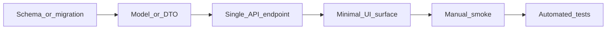

# superPlan

Use this skill when the user wants an **implementation plan** (Plan mode, `CreatePlan`, or "plan this feature"). Read this file fully before researching or emitting a plan.

## Quick start

1. **Research and discovery** — explore the codebase for existing patterns, routes, models, and tests. If decisions are still open, run [Plan discovery (grill-me)](#plan-discovery-grill-me) before assuming answers. Otherwise ask at most 1–2 blocking questions; prefer discovery over assumptions.
2. **Define Slice 0 (tracer bullet)** — smallest real path DB → API → UI with a visible UI outcome.
3. **Decompose remaining work** — vertical slices only; each slice should ideally change what the user sees.
4. **Design for testability** — every slice lists concrete tests; no "add tests later" slice.
5. **Emit the plan** — use the [Plan template](#plan-template) and [Quality gates](#quality-gates) before calling `CreatePlan` or presenting the final plan.

## Plan discovery (grill-me)

Use this phase when the plan or design still has unresolved branches, the user wants to stress-test a plan, or they say "grill me".

Interview me relentlessly about every aspect of this plan until we reach a shared understanding. Walk down each branch of the design tree, resolving dependencies between decisions one-by-one. For each question, provide your recommended answer.

Ask the questions one at a time.

If a question can be answered by exploring the codebase, explore the codebase instead.

Do not emit the final plan until major branches are resolved or the user explicitly asks to proceed with documented assumptions.

## Planning principles

- Always prefer vertical slices over horizontal layers.
- A "unit of work" should ideally result in a functional UI change.
- Prioritize "Tracer Bullet" development: get a simple path working from the DB to the UI as the very first step.
- Use DFT (design for testability), make sure every thing that you implement is can be tested and is tested!

## Vertical slices vs horizontal layers

| Horizontal (avoid) | Vertical (prefer) |
|--------------------|-------------------|
| All migrations, then all services, then all UI | One user-visible outcome end-to-end per slice |
| "Backend phase" / "frontend phase" | Slice named after what the user can do ("List widgets", "Create order") |
| Shared infra with no UI proof | Tracer bullet first: prove the stack, then deepen |

**Slice naming:** use user-visible outcomes, not layer names (`Slice 1: Add POST /widgets`, not `Slice 1: Service layer`).

**Slice size:** aim for one reviewable PR per slice when possible.

## Tracer bullet (Slice 0)

Slice 0 is always the tracer bullet — the thinnest **real** path from persistence to UI. Stubbed UI copy is fine; a mocks-only path is not.



### Tracer-bullet checklist

Copy and fill for Slice 0:

```
Tracer bullet (Slice 0):
- [ ] Outcome: [one sentence — what the user can see/do]
- [ ] DB: [migration / table / seed — minimal columns]
- [ ] Model/DTO: [thinnest shape for the happy path]
- [ ] API: [one route — read or write, not the full CRUD surface]
- [ ] Service: [only logic required for that route]
- [ ] UI: [minimal surface — list one row, submit one form, placeholder page OK]
- [ ] Auth/permissions: [only if blocking the path]
- [ ] Manual smoke: [how to verify in browser or API client]
- [ ] Tests: [list files — unit + route/UI as applicable]
```

Later slices **extend** the tracer path (validation, edge cases, polish, more endpoints) — they do not replace it with a parallel horizontal build.

## Slice template

Use this structure for **every** slice in the plan:

```markdown
## Slice N: [User-visible outcome]

**Outcome:** What the user can see or do after this slice.

| Layer | Work |
|-------|------|
| DB | … |
| API | … |
| UI | … |

**Tests:**
- `path/to/test_*.py` or `*.test.ts` — what behavior is covered

**Definition of done:**
- [ ] UI demonstrable (screenshot-level proof)
- [ ] Automated tests added/updated and would fail on regression
- [ ] No deferred "test in next slice" for core behavior introduced here
```

## DFT and testing

### Design rules

- Put **pure logic** (mapping, validation, calculations) in small modules/functions, not buried in page components or route handlers.
- **Inject dependencies** (DB sessions, HTTP clients, clocks) so services can be tested with mocks.
- Keep route handlers thin; test business rules in services or pure helpers.
- Match **existing project test style** (framework, file naming, fixtures) — discover before proposing new patterns.

### Test matrix (defaults per layer)

| Layer | Default test type |
|-------|-------------------|
| Pure logic / mappers | Unit tests; colocated `*.test.ts` or `test_*.py` |
| Services | Unit tests with mocks |
| HTTP API | Route/handler or contract test for the slice endpoint |
| UI behavior | Component/module vitest or jest; E2E only when the slice requires full browser flow |

**Rule:** no slice is complete without tests that would fail if the slice regressed.

### Implementation todos

When the plan includes todos, each `content` must name **deliverable + test**, e.g.:

- `Add GET /widgets endpoint + pytest for list mapper`
- `Wire widgets table on settings page + vitest for empty state`

## Anti-patterns

Do **not** structure plans like:

- "Phase 1: schema", "Phase 2: all endpoints", "Phase 3: UI"
- A final slice that is only "hook up UI" or "add tests"
- God functions or 500-line components with no extractable test surface
- Tracer bullet that stops at Postman with no UI surface
- Slices with no test deliverables

## Plan template

Emit plans in this shape (adapt sections as needed):

```markdown
# [Feature title]

## Overview
[1–2 sentences: goal and tracer-bullet summary]

## Tracer bullet (Slice 0)
- **Outcome:** …
- **DB:** …
- **API:** …
- **UI:** …
- **Tests:** …

## Slice 1: [User-visible name]
…

## Slice 2: [User-visible name]
…

## Test plan
- [ ] …

## Out of scope / follow-ups
- …
```

For `CreatePlan` tool output, also include actionable **todos** with stable `id` values; each todo ties deliverable to tests.

## Quality gates

Before finalizing the plan, confirm:

- [ ] **Slice 0** is the tracer bullet (DB → API → UI), not a horizontal foundation phase
- [ ] Every slice has a **UI delta** (or explicit note why not — rare infra-only exceptions)
- [ ] Every slice lists **specific tests** (files or behaviors), not "add tests"
- [ ] No horizontal-only phases ("all backend", then "all frontend")
- [ ] Research cited **real paths** from the codebase where known
- [ ] Open questions are minimal and blocking only

## Research discipline

- Search for similar features, routers, services, and existing tests before proposing new patterns.
- Reuse conventions (naming, folder layout, auth checks) from the repo.
- Cite file paths in the plan when they anchor decisions.
- Prefer codebase exploration over asking the user when the repo can answer the question.
- If the user attached a plan file, do not edit it unless asked — implement or revise in conversation output.

## Additional resources

- [examples.md](examples.md) — bad vs good plans and a full-stack tracer example
