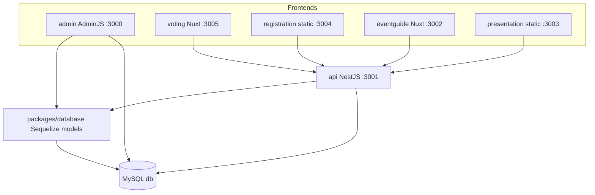

# Architecture

High-level map of the Coolest Projects monorepo. Per-package detail lives in [docs/apps/](apps/) and [packages/database.md](packages/database.md).

## System shape

## Workspace roles

| Workspace | Type | Talks to |
|-----------|------|----------|
| `packages/database` | Shared models | MySQL (via consumers) |
| `apps/api` | NestJS backend | `database`, MySQL, mail, file storage |
| `apps/admin` | AdminJS on Express | `database`, MySQL |
| `apps/voting` | Nuxt SPA | `api` |
| `apps/registration` | Static (`http-server`) | `api` (expected) |
| `apps/eventguide` | Nuxt 3 SPA | `api` (`EventguideController`) |
| `apps/presentation` | Static (`http-server`) | `api` (expected) |

## Key flows

### Registration

Participant registers via the registration site → `RegistrationController` / `RegistrationService` in `apps/api` → Sequelize models (`Registration`, `User`, `Project`, `Question*`, `Tshirt*`) in `packages/database`.

### Voting

Judge or participant uses `apps/voting` (Nuxt) → `VotingController` / `VotingService` in `apps/api` → `Vote`, `VoteCategory`, `UserProject` models.

### Admin operations

Staff use `apps/admin` (AdminJS) → direct Sequelize access via `@coolestprojects/database` → event-scoped resources filtered by admin role (`superadmin`, `admin`, `judge`).

### Event lifecycle

`Event` model holds dates and limits. API `EventService` and CLI (`npm run seed-db`) initialize event data. Exact production scheduling is not fully documented here.

## Local infrastructure

Dev Container (`.devcontainer/`) runs:

- `workspace` — Node dev environment, all apps
- `db` — MySQL
- `mailhog` — SMTP catcher; UI at http://localhost:18025
- `phpmyadmin` — port 3006
- `proxy` — TLS reverse proxy mapping `*.coolestprojects.localhost` → app ports

See [local-setup.md](local-setup.md).

## Production (Level27)

The reworked monorepo publishes to **Level27 Agency** hosting on `coolestprojects.be` (test hosts are `*-dev`, production hosts are unprefixed):

| Role | Components |
|------|------------|
| API / Admin | Node 24 on **separate hosts** (`api-dev`/`api-prod`, `admin-dev`/`admin-prod`) — they do not share a filesystem |
| Static SPAs | `phplegacy` paths under `public_html/{registration,voting,eventguide}` |
| Database | MySQL 8.4 `db-dev` / `db-prod` |
| Mail | Mailpit (`mail-dev`) and mail (`mail-prod`) |

Publish with [build-tools.md](build-tools.md) (`build_tools/`). Infra inventory lives in the sibling OpenTofu repo; this monorepo only ships artifacts.

**File storage:** uploaded binaries (project photos, floor plan SVGs) live on the **API** server under `UPLOAD_ROOT`. AdminJS reads/writes file metadata in MySQL and proxies floorplan uploads through Nest; it must not read or write `UPLOAD_ROOT` locally in production.

## Unknowns

- Full auth matrix across all frontends
- Whether `mail-prod` is an IMAP-capable mailbox, and what `IMAP_HOST` should be set to for it — the API's bounce-detection job (`CRON_JOB_BOUNCE`, see [docs/apps/api.md](apps/api.md#bounce-mail-detection)) reads bounces via IMAP; `IMAP_HOST` falls back to the outbound `SMTP_HOST` if unset, which is only correct if `mail-prod` is a real mailbox (rather than a capture-only tool like Mailpit) acting as both
