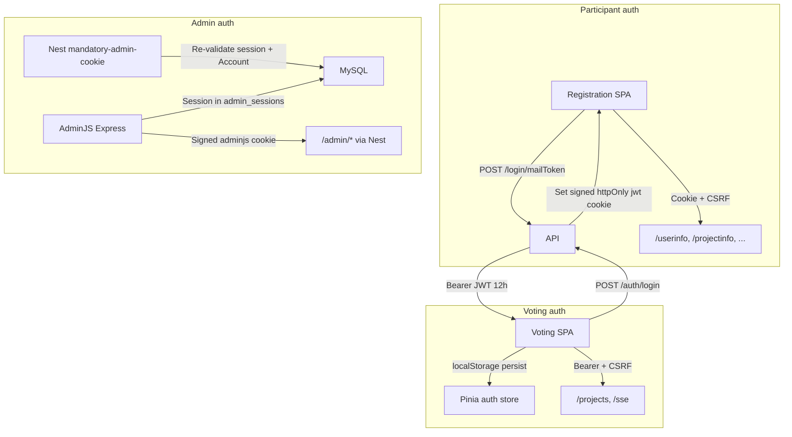

# Security Assessment — Coolest Projects Monorepo

**Date:** 2026-09-05  
**Scope:** Full monorepo (dev container, CI/CD, production deploy surface)  
**Method:** Static codebase analysis and configuration review — no live penetration testing  
**Status:** Assessment complete

---

## Executive summary

The Coolest Projects monorepo has several **well-implemented baseline controls** (CSRF double-submit, Helmet, CORS whitelist, bcrypt password hashing, signed httpOnly participant cookies, admin session DB re-validation on API routes). However, the assessment identified **3 critical**, **12 high**, **13 medium**, and **7 low/informational** findings.

**Overall posture:** Moderate risk — acceptable for a controlled event platform, but **not production-hardened** without addressing critical RBAC and auth gaps.

### Top 5 risks

| # | ID | Risk | Environment |
|---|-----|------|-------------|
| 1 | **C1** | AdminJS RBAC role string mismatch — `jury` accounts bypass intended `judge` restrictions; `super_admin` does not receive `superadmin` privileges | Prod |
| 2 | **H5/H6** | Unauthenticated `POST /presentation/generate` (Puppeteer) and always-on Swagger at `/api` | Prod |
| 3 | **H2/H3** | JWT empty-secret fallback; voting JWT accepted without DB re-validation | Prod |
| 4 | **H7** | 72 npm audit findings (2 critical, 19 high) with no CI gate or Dependabot | Both |
| 5 | **C2/C3** | TLS private keys committed to git; broken JWT file-auth Lua hook on dev proxy `/files` | Dev |

---

## Scope and methodology

### In scope

| Area | Paths reviewed |
|------|----------------|
| API (NestJS) | `apps/api/src/` — auth, controllers, services, config |
| Admin (AdminJS) | `apps/admin/src/` — auth, RBAC, resources, import-export |
| Frontends | `apps/eventguide`, `apps/voting`, `apps/registration`, `apps/presentation` |
| Database | `packages/database/src/models/` |
| Dev infrastructure | `.devcontainer/`, proxy templates, certs |
| CI/CD | `.github/workflows/`, `build_tools/` |
| Dependencies | `package-lock.json`, `npm audit` |

### Out of scope

- Live penetration testing or social engineering
- Level27 server infrastructure (only deploy scripts and env templates in repo)
- GDPR legal compliance determination (PII inventory provided only)
- `apps/cdj-web-int` archived galleries (legacy XSS surface noted separately)

### Verification method

Each finding was verified by reading source files, tracing auth flows, and (where applicable) running `git ls-files` and `npm audit`. Manual smoke checks (Swagger reachability, jury AdminJS login) were assessed via static analysis of route guards and RBAC code paths; live environment testing was not performed in this assessment.

---

## Authentication data flows



### Phase 2 findings — Authentication and sessions

| ID | Finding | Status | Evidence |
|----|---------|--------|----------|
| H2 | JWT empty-secret fallback (`JWT_KEY \|\| ''`) in token signing | **Verified** | `apps/api/src/tokens/tokens.service.ts` L15, L25 |
| H2 | JWT strategy uses `env.JWT_KEY` without startup validation | **Verified** | `apps/api/src/auth/jwt.strategy.ts` L16 |
| H3 | Voting JWT `validate()` returns payload as-is — no DB check for revoked/deleted jury | **Verified** | `apps/api/src/auth/jwt-voting.strategy.ts` L17-18 |
| H4 | Voting JWT stored in Pinia with `persist: true` → localStorage | **Verified** | `apps/voting/stores/auth.ts` L37 |
| M6 | Full magic-link JWTs logged when `NODE_ENV=development` | **Verified** | `apps/api/src/login/login.controller.ts` L105-120 |
| M7 | Admin session cookie `httpOnly` only when `NODE_ENV === 'production'` | **Verified** | `apps/admin/src/index.ts` L426 |

**Positive:** Participant auth uses signed httpOnly cookies (`apps/api/src/cookie-options.ts`). Admin API routes re-validate session against `AdminSession` + `Account` with `account_type IN ('super_admin', 'admin')` — jury sessions are rejected on Nest `/admin/*` routes (`apps/api/src/auth/adminauth.service.ts` L41-48). Voting login requires active event date range (`apps/api/src/auth/local-voting.strategy.ts` L26-36).

---

## Phase 3 — AdminJS RBAC matrix

`Authenticate` returns `role: account.account_type` directly from DB (`super_admin`, `admin`, `jury`). Authorisation code uses different strings (`superadmin`, `judge`).

### Role mapping defect (C1) — **Verified**

| DB `account_type` | Code checks for | Effect |
|-------------------|-----------------|--------|
| `super_admin` | `superadmin` in `canCreate` | Super-admins **denied** global create privileges |
| `jury` | `judge` in page `isAccessible` | Jury accounts **not blocked** from Email Templates / Floorplans |
| `jury` | `judge` in `assertNotJudge()` | Jury can access email template handlers |

### Jury (`account_type: jury`) resource access matrix — static analysis (H11)

| Resource / page | List | Create | Edit | Delete | Import/Export | Notes |
|-----------------|------|--------|------|--------|---------------|-------|
| Account | Yes | Yes* | Yes | Yes | No | No role filter |
| Event | Yes (filtered) | — | No** | No** | No | Edit/delete require `admin` role |
| Project | Yes | Yes | Yes | Yes | **Yes** | No jury restriction |
| User | Yes | Yes | Yes | Yes | **Yes** | **Full PII access** |
| Registration | Yes | Yes | Yes | Yes | **Yes** | **Full PII access** |
| Attachment | Yes | Yes | Yes | Yes | **Yes** | File paths exposed |
| Email Templates page | Yes | — | — | — | — | Intended block for `judge` fails for `jury` |
| Floorplans page | Yes | — | — | — | — | Same as above |
| Dashboard, VotingOverview, Tables | Yes | — | — | — | — | No role filter |
| Vote, VoteCategory | Yes | Yes | Yes | Yes | No | No role filter |

\* `canCreate` returns false for non-`superadmin` on Account resource.  
\** `canAccessResourceRoleFilter("admin")` on Event edit/show/delete.

**Conclusion:** A `jury` AdminJS login can list, edit, and bulk-export participant PII (User, Registration) for their selected event. This is likely unintended.

---

## Findings inventory

### Critical

| ID | Finding | Env | Status | Recommendation |
|----|---------|-----|--------|----------------|
| C1 | AdminJS RBAC role mismatch (`super_admin`/`jury` vs `superadmin`/`judge`) | Prod | **Verified** | Normalize role strings; add resource-level restrictions for `jury` |
| C2 | 12 TLS private keys + CA key committed to git (`.devcontainer/certs/pki/private/`) | Dev | **Verified** (61 cert files tracked) | Regenerate PKI; gitignore private keys; rotate if ever used outside isolated dev |
| C3 | Broken file JWT auth — `proxy.conf` calls `verify_jwt` but `jwt_auth.lua` is APISix plugin code with no `verify_jwt` export | Dev | **Verified** | Fix or remove Lua hook; confirm `/files` is unprotected in dev |

### High

| ID | Finding | Env | Status | Recommendation |
|----|---------|-----|--------|----------------|
| H1 | No rate limiting on login, magic-link, registration, voting, uploads | Both | **Verified** | Add `@nestjs/throttler` or equivalent |
| H2 | JWT empty-secret fallback allows signing/verification with missing env | Prod | **Verified** | Fail fast at startup if secrets empty |
| H3 | Voting JWT not re-validated against DB on each request | Prod | **Verified** | Re-check account exists and is `jury` |
| H4 | Voting JWT persisted in localStorage (XSS = full account compromise) | Prod | **Verified** | Document XSS risk; consider httpOnly cookie |
| H5 | `POST /presentation/generate` unauthenticated; launches Puppeteer | Prod | **Verified** | Add auth guard or network restriction |
| H6 | Swagger UI always enabled at `/api` | Prod | **Verified** | Disable or protect in production |
| H7 | No Dependabot; 72 npm audit findings (2 critical, 19 high, 51 moderate) | Both | **Verified** | Add Dependabot + audit CI gate |
| H8 | Hardcoded secrets in `docker-compose.yml` (JWT, DB, CSRF, admin cookie) | Dev | **Verified** | Confirm never reused in prod |
| H9 | Seed credentials `admin/admin`, `jury/jury`, etc. in `seed.ts` | Dev | **Verified** | Gate seeder; never run on shared DBs |
| H10 | Production schema via `DB_SYNC_ALTER=true` — runtime DDL | Prod | **Verified** | Versioned migrations; disable alter in prod |
| H11 | Jury AdminJS access largely unrestricted (see matrix above) | Prod | **Verified** | Resource-level RBAC for `jury` |
| H12 | `FileUploadController` uses `AuthGuard('filesign')` but strategy not implemented; controller not registered | Both | **Verified** | Remove dead code or implement; `FILE_SIGN_SECRET` unused |

### Medium

| ID | Finding | Env | Status | Recommendation |
|----|---------|-----|--------|----------------|
| M1 | No global `ValidationPipe`; DTOs have no `class-validator` decorators | Prod | **Verified** | Add ValidationPipe + decorators |
| M2 | SVG XSS via `innerHTML` in eventguide floorplan modal | Prod | **Verified** | Sanitize SVG; threat-model admin upload path |
| M3 | Multer memory upload without pre-size cap; defaults up to ~2 GB | Prod | **Verified** | Set Multer `limits.fileSize` |
| M4 | Upload validation trusts client-reported `mimetype` | Prod | **Verified** | Add magic-byte verification |
| M5 | `accountId` interpolated in `Sequelize.literal` | Prod | **Verified** | Use bind parameters |
| M6 | Dev token logging in login flow | Dev | **Verified** | Remove or redact |
| M7 | Admin cookies not httpOnly outside production | Dev | **Verified** | Use httpOnly in all environments |
| M8 | Registration draft PII in localStorage (`cp-registration-draft`) | Prod | **Verified** | Session-only storage or encryption |
| M9 | phpMyAdmin with `PMA_ARBITRARY=1` on host port 3006 | Dev | **Verified** | Restrict or remove |
| M10 | Deploy workflows have no test/audit/SAST before push | Both | **Verified** | Add pre-deploy security gates |
| M11 | Shared SSH deploy key across all components/environments | Prod | **Verified** | Separate keys per env |
| M12 | Eventguide exposes participant names, project data by `eventId` | Prod | **Verified** (intentional) | Confirm business acceptance; add rate limits |
| M13 | Hardcoded JWT fallback in smoke scripts matches dev compose secret | Dev | **Verified** | Remove fallbacks |

### Low / Informational

| ID | Finding | Env | Status |
|----|---------|-----|--------|
| L1 | `console.log('user:', req.user)` on voting login | Prod | **Verified** |
| L2 | Raw `throw new Error()` → inconsistent 500 responses | Prod | **Verified** |
| L3 | `.env.example` incomplete (`UPLOADS_DIR` vs `UPLOAD_ROOT`) | Both | **Verified** |
| L4 | No CSP headers on Nuxt SPAs | Prod | **Verified** |
| L5 | Directory indexing enabled on dev `/files` alias | Dev | **Verified** |
| L6 | SSH `StrictHostKeyChecking=accept-new` | Prod | **Verified** |
| L7 | PII stored plaintext in DB — no field-level encryption | Prod | **Verified** |

---

## PII inventory

### Database models with personal data

| Model | PII fields | Sensitivity |
|-------|-----------|-------------|
| `User` | email, firstname, lastname, postalcode, municipality_name, sex, birthmonth, gsm, gsm_guardian, email_guardian, medical, internalinfo | High |
| `Registration` | All User fields + street, house_number, box_number, project_name, project_descr | High |
| `Account` | email, encryptedPassword (bcrypt) | Medium |
| `AdminSession` | Serialized session blob in `data` column | Medium |
| `Attachment` | filepath, name, mimetype | Low–Medium |
| `Project` | internalInformation | Medium |

Source: `packages/database/src/models/user.model.ts`, `registration.model.ts`

### Export paths

| Path | Data exposed | Auth required |
|------|-------------|---------------|
| AdminJS import-export on User, Registration, Project, Attachment, EventTable, EmailTemplate, Affiliation, Vote | Bulk CSV/JSON of all resource fields | AdminJS session (any role including jury) |
| `view_Export_all` SQL view | email, names, phones, medical, internal info, voucher GUIDs, project details | Deployed via `build_tools/lib/sql-views.mjs`; accessed via Admin dashboard |
| `GET /eventguide/events/:eventId/projects` | Participant first+last names (formatted), project names/descriptions, table numbers, thumbnails (with photo consent) | **None** |
| `GET /eventguide/attachments/:id/thumbnail` | Project thumbnails | **None** (requires `confirmed: true` + photo consent) |
| Nest `/admin/*` endpoints | Floorplan upload, event management | Admin cookie (super_admin or admin only on API) |

---

## Public API endpoint inventory

| Method | Path | Auth | Risk |
|--------|------|------|------|
| GET | `/tshirts`, `/questions`, `/dojos`, `/approvals`, `/settings` | None | Low — event metadata |
| POST | `/registration` | None (+ CSRF) | Medium — open registration |
| POST | `/login`, `/login/mailToken` | None (+ CSRF) | Medium — magic-link abuse |
| POST | `/auth/login` | None (+ CSRF) | Medium — jury brute force |
| GET | `/eventguide/projects` | None | Low — current event projects |
| GET | `/eventguide/events/:eventId/projects` | None | Medium — event enumeration |
| GET | `/eventguide/floorplans/:filename` | None | Low — path traversal mitigated |
| GET | `/eventguide/attachments/:id/thumbnail` | None | Low — ID enumeration mitigated by consent |
| GET | `/presentation` | None | Low |
| POST | `/presentation/generate` | **None** | **High** — Puppeteer resource exhaustion |
| GET | `/api` (Swagger UI) | **None** | **High** — full API enumeration |
| GET | `/csrf-token` | None | Low |

---

## Environment variable secret map

| Variable | Used by | In git? | Notes |
|----------|---------|---------|-------|
| `JWT_KEY` | API participant JWT, cookie signing | Dev compose only | Empty fallback in code |
| `VOTING_KEY` | Voting Bearer JWT | Dev compose only | Separate from participant |
| `CSRF_SECRET` | CSRF HMAC | Dev compose only | |
| `ADMINJS_COOKIE_SECRET` | AdminJS session + cookie signing | Dev compose only | |
| `DB_PASSWORD` | MySQL | Dev compose only | Prod: blank in example, filled in remote `.env` |
| `FILE_SIGN_SECRET` | Intended file JWT auth | Dev compose only | **Unused in API code** |
| `APACHE_SECRET` | Dev proxy | Dev compose only | |
| `L27_SSH_PRIVATE_KEY` | GitHub Actions deploy | GitHub Secrets | Shared across components |

Production secrets are managed via `build_tools/secrets/*.env` (gitignored) and pre-existing remote `.env` files. Deploy never overwrites remote `.env` once created.

---

## Positive controls

- CSRF double-submit via `csrf-csrf` with per-session `anonId` / user binding (`apps/api/src/main.ts`)
- Helmet HTTP headers on API (`apps/api/src/bootstrap-security.ts`)
- CORS explicit origin whitelist with credentials
- bcrypt cost 12 for admin/jury passwords (`packages/database/src/models/account.model.ts`)
- Signed httpOnly cookies for participant auth (`apps/api/src/cookie-options.ts`)
- Separate JWT secrets for participant vs voting
- Admin session re-validation on Nest API routes (jury rejected)
- Floorplan path traversal protection (`apps/api/src/eventguide/floorplan-path.ts`)
- Email enumeration protection on magic-link endpoint
- Deploy does not overwrite existing remote `.env`
- MySQL not host-exposed in dev compose
- Admin email preview uses sandboxed iframe
- Photo consent gate for eventguide thumbnails
- IMAP TLS with `rejectUnauthorized: true` (`apps/api/src/background/background.service.ts`)

---

## Remediation priority matrix

### P0 — Address immediately

| Finding | Action |
|---------|--------|
| C1 | Fix AdminJS role string mapping; restrict jury resource access |
| H2 | Add startup validation: fail if `JWT_KEY`, `VOTING_KEY`, `CSRF_SECRET` empty |
| H5 | Add auth guard to `POST /presentation/generate` |
| H6 | Disable Swagger in production (`NODE_ENV=production`) |

### P1 — Address before next event cycle

| Finding | Action |
|---------|--------|
| H1 | Rate limiting on auth, registration, upload endpoints |
| H3/H4 | Voting JWT DB re-validation; document XSS risk for localStorage token |
| H7 | Add Dependabot + `npm audit` CI gate |
| H11 | Complete jury RBAC audit and lock down PII resources |
| M2 | Sanitize SVG in eventguide modal |
| C2/C3 | Remove committed TLS keys; fix dev proxy file auth |

### P2 — Hardening

| Finding | Action |
|---------|--------|
| M1 | Global ValidationPipe + class-validator on DTOs |
| M3/M4 | Multer size limits; magic-byte file type check |
| M5 | Parameterize SQL in voting service |
| M8 | Registration draft storage review (GDPR) |
| H10 | Versioned migrations; disable `DB_SYNC_ALTER` in prod |
| M10/M11 | CI security gates; separate deploy SSH keys |
| L7 | PII data classification and retention policy |

---

## Dependency audit snapshot

Run date: 2026-09-05

```
72 vulnerabilities (51 moderate, 19 high, 2 critical)
```

Notable findings:
- **Critical:** `@nuxt/devtools` — unauthenticated RPC (dev dependency; verify not shipped to prod)
- **High:** `node-tar` stack overflow DoS
- **Moderate:** `@tiptap/core` via `@adminjs/design-system` (admin panel)

No automated scanning in CI. Recommend `npm audit` in deploy workflow and Dependabot for `package-lock.json`.

---

## Appendix A — Phase verification notes

### Phase 1: Secrets (C2, H8, M13)

- `git ls-files .devcontainer/certs/` returns 61 tracked files including 12 `*.key` files and `ca.key`
- `.devcontainer/docker-compose.yml` L15-41: plaintext JWT, DB, CSRF, admin cookie secrets
- `apps/registration/scripts/auth-cross-origin-smoke.mjs` L11: JWT_KEY fallback matches compose value
- `build_tools/env/api-prod.env.example`: secrets left blank (correct); `DB_SYNC_ALTER=true` documented

### Phase 4: Validation (M1, M5)

- Zero `class-validator` decorators in `apps/api/src/dto/`
- No `ValidationPipe` in `app.module.ts` or `main.ts`
- Registration has manual validation in `registration.service.ts` (substantial business rules)
- `voting.service.ts` L82-84: `accountId` from JWT interpolated into `Sequelize.literal`

### Phase 5: Files and XSS (C3, H12, M2-M4)

- `ProjectTableModal.vue` L104: `svgHost.value.innerHTML = svgText`
- `file-upload.controller.ts`: `filesign` guard; not in `app.module.ts` controllers list
- `FileInterceptor('file')` with no Multer limits in `projectinfo.controller.ts` L103-105
- `file-validation.interceptor.ts` L42: checks `file.mimetype` from client

### Phase 8: Infrastructure (H7, H10, M9-M11)

- `.github/workflows/`: only `deploy-test.yml` and `deploy-prod.yml` — no test/audit jobs
- `database-sync.ts`: `DB_SYNC_ALTER=true` enables `sync: { alter: true }` even in production
- `docker-compose.yml` L95-102: phpMyAdmin on port 3006 with `PMA_ARBITRARY=1`
- `build_tools/lib/ssh.mjs` L12: `StrictHostKeyChecking=accept-new`

---

## Suggested follow-up

If remediation is requested, prioritize P0 items as a first PR (RBAC fix + secret validation + Swagger/presentation lockdown). A separate effort should add CI security gates and dependency scanning.
