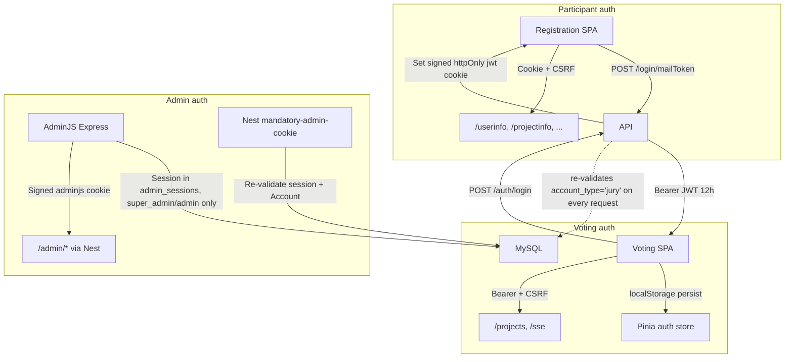

# Security Assessment — Coolest Projects Monorepo

**Original assessment:** 2026-09-05
**Last re-verified:** 2026-09-12
**Scope:** Full monorepo (dev container, CI/CD, production deploy surface)
**Method:** Static codebase analysis and configuration review — no live penetration testing
**Status:** Re-verification complete — remediation in progress

---

## Executive summary

Since the 2026-09-05 baseline, **9 of the original 22 critical/high findings have been fixed** (2 of 3 critical, 7 of 12 high), including the top two risks from the original report (AdminJS RBAC role mismatch, unauthenticated Puppeteer endpoint), the dev-proxy JWT auth break, and — this pass — rate limiting on the endpoints named in H1. Swagger UI (`/api`) was also gated out of production. No medium or low finding has changed since the baseline — those 13 medium and 7 low items are carried forward unchanged. Dependency findings got slightly worse (72 → 78 npm audit findings) since no CI gate exists yet.

**Overall posture:** Moderate risk, improving. C2 (committed TLS private keys) is confirmed to be dev-only tooling — a self-signed easy-rsa CA used solely by the dev container's local HTTPS proxy, never referenced by prod config or deploy scripts, and committed intentionally so every contributor gets an identical multi-subdomain cert layout for testing. It remains a git-hygiene item worth cleaning up (gitignore + generation script) but is not a production secret exposure. With H1 addressed, the item with the largest real blast radius that is still open is the CI/dependency hardening (H7) flagged as a separate effort in the original report, followed by the voting-JWT/localStorage and `DB_SYNC_ALTER` pair (H4/H10).

### Top 5 risks (current)

| # | ID | Risk | Environment |
|---|-----|------|-------------|
| 1 | **H7** | 78 npm audit findings (2 critical, 20 high) — no CI gate or Dependabot; worse than baseline (72) | Both |
| 2 | **H4/H10** | Voting JWT persisted in localStorage (XSS = full account compromise); `DB_SYNC_ALTER` still allows runtime DDL in prod | Prod |
| 3 | **M-cluster** | Unsanitized SVG `innerHTML`, no Multer size caps, client-supplied `mimetype` trusted, no global `ValidationPipe` — all unchanged | Prod |
| 4 | **H8/H9** | Hardcoded secrets in `docker-compose.yml`; seed credentials (`admin`/`admin`, `jury`/`jury`) — dev-only but still open | Dev |
| 5 | **C2** | TLS private keys + CA key still committed to git — dev-only self-signed easy-rsa CA (see context below), not a production secret, but still a git-hygiene item | Dev |

### What's been fixed since 2026-09-05

| ID | Finding | Fix verified |
|----|---------|---------------|
| C1 | AdminJS RBAC role string mismatch | Resolved architecturally — jury accounts no longer authenticate into AdminJS at all; they use the voting SPA instead (`apps/admin/src/authorisations.ts`). The `judge`/`jury` string bug is moot. |
| C3 | Broken Lua JWT auth on dev proxy `/files` | `jwt_auth.lua` deleted outright ("cleanup - remove lua"); `proxy.conf` no longer references it. |
| H2 | JWT empty-secret fallback | `tokens.service.ts` / `jwt.strategy.ts` now use `config.getOrThrow('api.jwt')` — fails fast on missing secret instead of `\|\| ''`. |
| H3 | Voting JWT not re-validated against DB | `jwt-voting.strategy.ts` now re-checks `account_type: 'jury'` against the DB on every request; a revoked/demoted account loses access before token expiry. |
| H5 | Unauthenticated `POST /presentation/generate` | Now behind `PresentationAuthGuard`. |
| H6 | Swagger UI always enabled at `/api` | **Fixed in this pass** — `main.ts` now only builds/mounts the Swagger document when `NODE_ENV !== 'production'`. |
| H11 | Jury AdminJS access largely unrestricted | Resolved as a consequence of C1 — jury has no AdminJS session to exploit. |
| H12 | Dead `filesign` guard / unregistered controller | Old `file-upload.controller.ts` removed; uploads now go through Multer in the admin app ("move admin fileupload to multer"). |
| H1 | No rate limiting on login, magic-link, registration, voting, uploads | `@nestjs/throttler` added to `apps/api` and applied per-route (not as a global `APP_GUARD` — see rationale below) to the three endpoints with real abuse value: `POST /login/mailToken` (5/min, email-bomb/enumeration risk), `POST /registration` (10/min, scripted mass registration), `POST /auth/login` voting (5/min, jury brute force — the exact risk H1's own endpoint inventory named). Verified with a standalone smoke test: 5 requests succeed, the 6th returns a real `429`. |

---

## Scope and methodology

Unchanged from the original assessment — see [in scope](#in-scope-original) / [out of scope](#out-of-scope-original) below. This pass re-read every file cited as evidence in the 2026-09-05 report plus the commits landed since, rather than re-running the full discovery process from scratch.

### In scope <a name="in-scope-original"></a>

| Area | Paths reviewed |
|------|----------------|
| API (NestJS) | `apps/api/src/` — auth, controllers, services, config |
| Admin (AdminJS) | `apps/admin/src/` — auth, RBAC, resources, import-export |
| Frontends | `apps/eventguide`, `apps/voting`, `apps/registration`, `apps/presentation` |
| Database | `packages/database/src/models/` |
| Dev infrastructure | `.devcontainer/`, proxy templates, certs |
| CI/CD | `.github/workflows/`, `build_tools/` |
| Dependencies | `package-lock.json`, `npm audit` |

### Out of scope <a name="out-of-scope-original"></a>

- Live penetration testing or social engineering
- Level27 server infrastructure (only deploy scripts and env templates in repo)
- GDPR legal compliance determination (PII inventory provided only)
- `apps/cdj-web-int` archived galleries (legacy XSS surface noted separately)

### Verification method

Each finding below was re-verified by reading current source at the same file/line references (updated where code moved), plus `git log --since=2026-09-05` to see what landed. `npm audit` was re-run for the dependency snapshot. Live environment testing was not performed.

---

## Authentication data flows (current)



Jury accounts no longer appear in the admin subgraph at all — they exist only in the voting flow now, closing the C1/H11 exposure at the architecture level rather than by patching role strings.

### Authentication and sessions — current status

| ID | Finding | Status | Evidence |
|----|---------|--------|----------|
| H2 | JWT empty-secret fallback (`JWT_KEY \|\| ''`) in token signing | **Fixed** | `apps/api/src/tokens/tokens.service.ts`, `apps/api/src/auth/jwt.strategy.ts` — both use `getOrThrow` |
| H3 | Voting JWT `validate()` returns payload as-is — no DB check | **Fixed** | `apps/api/src/auth/jwt-voting.strategy.ts` L17-31 |
| H4 | Voting JWT stored in Pinia with `persist: true` → localStorage | **Open, unchanged** | `apps/voting/stores/auth.ts` L37 |
| M6 | Full magic-link JWTs logged when `NODE_ENV=development` | **Open, unchanged (by design — dev-gated)** | `apps/api/src/login/login.controller.ts` L125, L141 |
| M7 | Admin session cookie `httpOnly` only when `NODE_ENV === 'production'` | **Open, unchanged (by design — see note)** | `apps/admin/src/index.ts` L667 |

**Positive controls confirmed still in place:** Participant auth signed httpOnly cookies; Nest `/admin/*` re-validation against `AdminSession` + `Account`; voting login active-date-range check.

---

## AdminJS RBAC — resolved

The original C1/H11 role-mapping defect and jury PII-export matrix no longer apply: `apps/admin/src/authorisations.ts` documents that jury accounts never reach the admin app, and no reference to `jury` remains anywhere in `apps/admin/src/index.ts`. The only roles the admin app's authorization code deals with now are `super_admin` and `admin`, checked consistently (e.g. `canAccessResourceRoleFilter('super_admin')`), so the original string-mismatch bug (`superadmin`/`judge` vs. DB values) has no surface left to trigger on.

No new resource-level RBAC audit was needed for `super_admin`/`admin` since the original report did not flag a defect there beyond the jury issue.

---

## Findings inventory

### Critical

| ID | Finding | Env | Status | Recommendation |
|----|---------|-----|--------|----------------|
| C1 | AdminJS RBAC role mismatch (`super_admin`/`jury` vs `superadmin`/`judge`) | Prod | **Fixed** | — |
| C2 | 12 TLS private keys + CA key committed to git (`.devcontainer/certs/pki/private/`) | Dev | **Open, unchanged** (still 12 tracked `.key` files) — **context:** this is a self-signed easy-rsa CA generated per `.devcontainer/certs/README.md`, used only by the dev container's local HTTPS proxy for `*.coolestprojects.localhost`; it is not referenced by any prod config, build, or deploy script (confirmed: only `docker-compose.yml`/`start.sh` under `.devcontainer/` touch it), and is never reused outside the dev container. It's committed intentionally so every contributor gets an identical multi-subdomain cert layout (`api.`, `registration.`, `voting.`, `eventguide.`, `admin.`, `presentation.` `*.coolestprojects.localhost`) without each person regenerating and re-trusting their own CA. | Document as intentional dev-only tooling rather than a leaked production secret; still worth gitignoring the private keys and generating them via a setup script (`docs/local-setup.md`) to avoid every clone sharing the same CA key, and to stop off-the-shelf secret scanners from flagging it as a live finding each time |
| C3 | Broken file JWT auth — `proxy.conf` called `verify_jwt`, `jwt_auth.lua` had no export | Dev | **Fixed** | — |

### High

| ID | Finding | Env | Status | Recommendation |
|----|---------|-----|--------|----------------|
| H1 | No rate limiting on login, magic-link, registration, voting, uploads | Both | **Fixed, scoped (this pass)** | `@nestjs/throttler` per-route on `/login/mailToken`, `/registration`, voting `/auth/login`. Deliberately **not** a global `APP_GUARD`: event-day traffic legitimately comes from many participants behind one shared venue/school NAT, so a blanket per-IP limit risks locking out a whole room. Participant-facing attachment uploads were left unthrottled for the same reason (already behind `JwtUserAuthGuard`, and a real classroom/venue can legitimately generate a burst of uploads) — revisit if abuse is observed |
| H2 | JWT empty-secret fallback | Prod | **Fixed** | — |
| H3 | Voting JWT not re-validated against DB on each request | Prod | **Fixed** | — |
| H4 | Voting JWT persisted in localStorage (XSS = full account compromise) | Prod | **Open, unchanged** | Document XSS risk; consider httpOnly cookie |
| H5 | `POST /presentation/generate` unauthenticated; launches Puppeteer | Prod | **Fixed** | — |
| H6 | Swagger UI always enabled at `/api` | Prod | **Fixed (this pass)** | Gated behind `NODE_ENV !== 'production'` in `apps/api/src/main.ts` |
| H7 | No Dependabot; npm audit findings up to 78 (2 critical, 20 high, 56 moderate) | Both | **Open, worse** (was 72) | Add Dependabot + audit CI gate |
| H8 | Hardcoded secrets in `docker-compose.yml` (JWT, DB, CSRF, admin cookie) | Dev | **Open, unchanged** | Confirm never reused in prod |
| H9 | Seed credentials `admin/admin`, `jury/jury`, etc. in `seed.ts` | Dev | **Open, unchanged** | Gate seeder; never run on shared DBs |
| H10 | Production schema via `DB_SYNC_ALTER=true` — runtime DDL | Prod | **Open, unchanged** | Versioned migrations; disable alter in prod |
| H11 | Jury AdminJS access largely unrestricted | Prod | **Fixed** (resolved via C1) | — |
| H12 | `FileUploadController` used unimplemented `filesign` strategy; dead code | Both | **Fixed** | Old controller removed; uploads now via Multer in admin app. Follow-up: `FILE_SIGN_SECRET`, `FILE_BASE_URL`, `FILE_SIGNATURE_EXPIRATION` env vars (its only remaining dependents) removed from `.devcontainer/docker-compose.yml` |

### Medium

*All 13 medium findings from the 2026-09-05 baseline were re-checked and remain open, unchanged:*

| ID | Finding | Env | Status |
|----|---------|-----|--------|
| M1 | No global `ValidationPipe`; DTOs have no `class-validator` decorators | Prod | **Open, unchanged** |
| M2 | SVG XSS via `innerHTML` in eventguide floorplan modal | Prod | **Open, unchanged** (`ProjectTableModal.vue` L77, 104, 135) |
| M3 | Multer memory upload without pre-size cap | Prod | **Open, unchanged** (`projectinfo.controller.ts` `FileInterceptor('file')` still has no `limits`) |
| M4 | Upload validation trusts client-reported `mimetype` | Prod | **Open, unchanged** (`file-validation.interceptor.ts` L41) |
| M5 | `accountId` interpolated in `Sequelize.literal` | Prod | **Open, unchanged** (`voting.service.ts`) |
| M6 | Dev token logging in login flow | Dev | **Open, unchanged (by design)** |
| M7 | Admin cookies not httpOnly outside production | Dev | **Open, unchanged (by design)** |
| M8 | Registration draft PII in localStorage (`cp-registration-draft`) | Prod | **Open, unchanged** |
| M9 | phpMyAdmin with `PMA_ARBITRARY=1` on host port 3006 | Dev | **Open, unchanged** |
| M10 | Deploy workflows have no test/audit/SAST before push | Both | **Open, unchanged** (still only `deploy-test.yml`/`deploy-prod.yml`) |
| M11 | Shared SSH deploy key across all components/environments | Prod | **Open, unchanged** (`L27_SSH_PRIVATE_KEY` in both workflows) |
| M12 | Eventguide exposes participant names, project data by `eventId` | Prod | **Open, unchanged (intentional)** |
| M13 | Hardcoded JWT fallback in smoke scripts matches dev compose secret | Dev | **Open, unchanged** |

### Low / Informational

*All 7 low/informational findings remain open, unchanged:*

| ID | Finding | Env | Status |
|----|---------|-----|--------|
| L1 | `console.log(...)` on voting login | Prod | **Open, unchanged** (`voting.controller.ts` L72, L165) |
| L2 | Raw `throw new Error()` → inconsistent 500 responses | Prod | **Open, unchanged** (84 occurrences) |
| L3 | Env var naming mismatch — code uses `UPLOAD_ROOT` everywhere; `apps/api/.env.example` documents `UPLOADS_DIR` | Both | **Open, unchanged** (root cause identified: the example file is stale, not the prod template) |
| L4 | No CSP headers on Nuxt SPAs | Prod | **Open, unchanged** |
| L5 | Directory indexing on dev `/files` alias | Dev | **Open, unchanged** |
| L6 | SSH `StrictHostKeyChecking=accept-new` | Prod | **Open, unchanged** |
| L7 | PII stored plaintext in DB — no field-level encryption | Prod | **Open, unchanged** |

---

## PII inventory

Unchanged from the 2026-09-05 baseline — no model or export-path changes were found in this pass. See original tables (models: `User`, `Registration`, `Account`, `AdminSession`, `Attachment`, `Project`; export paths: AdminJS import-export, `view_Export_all`, eventguide public endpoints).

One export-path note: since jury no longer has an AdminJS session (C1/H11 fix), the "AdminJS session (any role including jury)" access note for bulk CSV/JSON export no longer applies — it's effectively `super_admin`/`admin` only now.

---

## Public API endpoint inventory (delta)

| Method | Path | Auth | Risk | Change |
|--------|------|------|------|--------|
| POST | `/presentation/generate` | **Now guarded** (`PresentationAuthGuard`) | Was High, now Low | Fixed (H5) |
| GET | `/api` (Swagger UI) | **Now dev/test only** | Was High in prod, now not exposed in prod | Fixed (H6, this pass) |

All other endpoints from the original inventory are unchanged.

---

## Environment variable secret map

Unchanged from the 2026-09-05 baseline except `FILE_SIGN_SECRET` — `JWT_KEY`, `VOTING_KEY`, `CSRF_SECRET`, `ADMINJS_COOKIE_SECRET`, `DB_PASSWORD`, `APACHE_SECRET` remain dev-compose-only; `L27_SSH_PRIVATE_KEY` remains a single shared GitHub secret across both deploy workflows (M11, still open). `FILE_SIGN_SECRET`, along with the unused `FILE_BASE_URL` and `FILE_SIGNATURE_EXPIRATION` it was paired with, has been removed from `.devcontainer/docker-compose.yml` — the `filesign`-guarded controller they supported was already gone (H12 fix), so the env vars were pure dead weight.

---

## Positive controls (reconfirmed)

- CSRF double-submit via `csrf-csrf` with per-session `anonId` / user binding
- Helmet HTTP headers on API
- CORS explicit origin whitelist with credentials
- bcrypt cost 12 for admin/jury passwords
- Signed httpOnly cookies for participant auth
- Separate JWT secrets for participant vs voting
- Admin session re-validation on Nest API routes
- Floorplan path traversal protection
- Email enumeration protection on magic-link endpoint
- Deploy does not overwrite existing remote `.env`
- MySQL not host-exposed in dev compose
- Admin email preview uses sandboxed iframe
- Photo consent gate for eventguide thumbnails
- IMAP TLS with `rejectUnauthorized: true`

**New since baseline:**
- Voting JWT strategy re-validates jury account existence/role against the DB on every request (H3 fix)
- Jury accounts have no path into AdminJS at all (C1/H11 fix)
- Swagger/OpenAPI surface not mounted in production (H6 fix, this pass)
- Rate limiting (`@nestjs/throttler`) on magic-link request, registration, and voting login (H1 fix, this pass)

---

## Remediation priority matrix (updated)

### P0 — Address immediately

| Finding | Action | Status |
|---------|--------|--------|
| C1 | Fix AdminJS role string mapping; restrict jury resource access | **Done** |
| H2 | Add startup validation: fail if `JWT_KEY`, `VOTING_KEY`, `CSRF_SECRET` empty | **Done** |
| H5 | Add auth guard to `POST /presentation/generate` | **Done** |
| H6 | Disable Swagger in production | **Done (this pass)** |

All original P0 items are now closed.

### P1 — Address before next event cycle

| Finding | Action | Status |
|---------|--------|--------|
| H1 | Rate limiting on auth, registration, upload endpoints | **Done** (scoped to login/mailToken, registration, voting login — see Findings inventory above for why uploads and a global guard were deliberately skipped) |
| H3/H4 | Voting JWT DB re-validation; document XSS risk for localStorage token | H3 **done**; H4 doc/mitigation still **open** |
| H7 | Add Dependabot + `npm audit` CI gate | **Open** (findings count rising) |
| H11 | Complete jury RBAC audit and lock down PII resources | **Done** (resolved via C1) |
| M2 | Sanitize SVG in eventguide modal | **Open** |
| C2/C3 | Remove committed TLS keys; fix dev proxy file auth | C3 **done**; C2 downgraded in priority — confirmed dev-only, not a production secret; still worth a git-hygiene cleanup (gitignore + generation script) but no longer urgent |

### P2 — Hardening

| Finding | Action | Status |
|---------|--------|--------|
| M1 | Global ValidationPipe + class-validator on DTOs | **Open** |
| M3/M4 | Multer size limits; magic-byte file type check | **Open** |
| M5 | Parameterize SQL in voting service | **Open** |
| M8 | Registration draft storage review (GDPR) | **Open** |
| H10 | Versioned migrations; disable `DB_SYNC_ALTER` in prod | **Open** |
| M10/M11 | CI security gates; separate deploy SSH keys | **Open** |
| L7 | PII data classification and retention policy | **Open** |

---

## Dependency audit snapshot

Run date: 2026-09-12 (baseline: 2026-09-05)

```
78 vulnerabilities (56 moderate, 20 high, 2 critical)
```

Baseline was 72 (51 moderate, 19 high, 2 critical) — findings increased across the board. No automated scanning has been added to CI since the baseline; H7/M10 remain open. Recommend `npm audit` in the deploy workflow and Dependabot for `package-lock.json` as the next concrete step.

---

## Appendix A — Re-verification notes (2026-09-12)

- `git log --oneline --since=2026-09-05` reviewed; commits relevant to this re-verification: `ca9c0bc` (adminjs auth logic), `0e79b2d` (remove lua), `76f6476` (auth cleanup & simplification), `f4e888a` (enable some extra security), `ae0e814` (move admin fileupload to multer), `5ca8c39` (presentation capabilities).
- C1/H11: `grep -rn "jury" apps/admin/src/` now returns only the comment in `authorisations.ts` explaining jury never reaches the app.
- H2: `apps/api/src/tokens/tokens.service.ts` and `apps/api/src/auth/jwt.strategy.ts` both call `config.getOrThrow<string>('api.jwt')`.
- H3: `apps/api/src/auth/jwt-voting.strategy.ts` L17-31 — DB lookup with `account_type: 'jury'` guard, comment explains rationale.
- H5: `apps/api/src/presentation/*.controller.ts` — `@UseGuards(PresentationAuthGuard)` at class level.
- H6: fixed in this session — `apps/api/src/main.ts` now wraps `DocumentBuilder`/`SwaggerModule.createDocument`/`SwaggerModule.setup` in `if (env.NODE_ENV !== 'production')`. Verified `npm run build --workspace=apps/api` succeeds.
- H12: `find apps/api/src -iname "*file-upload*"` no longer returns a controller, only `file-upload.service.ts`.
- C3: `git show --stat 0e79b2d` — `jwt_auth.lua` deleted (396 lines removed); `proxy.conf` has no `verify_jwt`/`lua` references.
- C2: `git ls-files .devcontainer/certs/ | grep -c '\.key$'` → still 12. Confirmed dev-only scope: `grep -rln "certs/pki\|.devcontainer/certs" --include=*.yml --include=*.ts --include=*.mjs --include=*.sh .` returns only `.devcontainer/docker-compose.yml` and `.devcontainer/start.sh` — no build/deploy script or prod config references it. `.devcontainer/certs/README.md` documents it as a self-signed easy-rsa CA (password `cool`, per the doc) generated so `api./registration./voting./eventguide./admin./presentation.coolestprojects.localhost` all get trusted HTTPS locally with one shared CA — the reason it's committed rather than gitignored-and-regenerated-per-clone.
- H7: `npm audit` → 78 vulnerabilities (2 critical, 20 high, 56 moderate), up from 72.
- M3/M4: `projectinfo.controller.ts` L160 `FileInterceptor('file')` has no `limits`; `file-validation.interceptor.ts` L41 checks `file.mimetype`.
- L3: root cause clarified — `apps/api/src/**/*.ts` uses `process.env.UPLOAD_ROOT` exclusively (11 references across `presentation-path.ts`, `floorplan-path.ts`, `file-upload.service.ts`, `certificate-path.ts`, `configuration.ts`, seeders); `apps/api/.env.example` still documents the old `UPLOADS_DIR` name, `build_tools/env/api-prod.env.example` already has the correct `UPLOAD_ROOT`.
- H1: fixed in this session — added `@nestjs/throttler` (`apps/api/package.json`), registered via `ThrottlerModule.forRoot([{ ttl: 60000, limit: 20 }])` in `app.module.ts` (imported, not bound as `APP_GUARD`), and applied `@UseGuards(ThrottlerGuard, ...)` + `@Throttle(...)` to `login.controller.ts` (`POST /login/mailToken`, 5/min), `registration.controller.ts` (`POST /registration`, 10/min), and `voting.controller.ts` (`POST /auth/login`, 5/min) — `ThrottlerGuard` listed first in each `@UseGuards(...)` so a throttled request never reaches the underlying auth guard's bcrypt/DB check. Verified with a standalone Nest app mirroring the mailToken config: 5 requests returned `201`, the 6th and 7th returned `429`. Existing unit specs for the three touched controllers needed `ThrottlerModule.forRoot(...)` added to their `TestingModule` (`login.controller.spec.ts`, `registration.controller.spec.ts`, `voting.controller.spec.ts`) so `ThrottlerGuard`'s constructor deps resolve — `npm test --workspace=apps/api` confirmed identical pass/fail counts to the pre-change baseline (11 failed suites / 19 failed tests, all pre-existing) afterward.

---

## Suggested follow-up

P0 is fully closed, and H1 (rate limiting) is now done. Next recommended PR: Dependabot/npm audit CI gate (H7) — the current top real risk. SVG sanitization (M2) and Multer limits (M3/M4) are small, isolated fixes that could ride along in the same PR or immediately after. C2's git-hygiene cleanup (gitignore the private keys, add a generation script per `docs/local-setup.md`) and the H8/H9 dev-secret/seed-credential cleanup are worth doing but are no longer time-critical.
